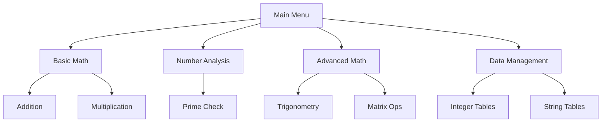

# 🧮 Ultimate C++ Calculator Program ✨


## 🌟 Overview
This is a feature-rich console-based calculator program written in C++ that offers **30+ mathematical operations** with beautiful console formatting. The program combines simplicity with advanced functionality in an intuitive menu-driven interface.


## 🎯 Features


### 🔢 Basic Arithmetic Operations
| Operation | Emoji | Description |
|-----------|-------|-------------|
| Addition | ➕ | Sums multiple numbers |
| Subtraction | ➖ | Subtracts multiple numbers |
| Multiplication | ✖️ | Multiplies multiple numbers |
| Division | ➗ | Various division operations with floating point precision |
| Power | ⚡ | Raises numbers to any power |
| Square | ² | Calculates square of a number |
| Square Root | √ | Calculates precise square roots |


### 🔍 Number Analysis
| Operation | Emoji | Description |
|-----------|-------|-------------|
| Even/Odd Check | 🔢 | Determines if number is even or odd |
| Prime Check | 🔍 | Checks if number is prime |
| Absolute Value | 🎯 | Gets absolute value of any number |
| Factorial | ❗ | Calculates factorial of numbers |
| Logarithm | 📊 | Calculates base-10 logarithm |


### 📐 Advanced Mathematics
| Operation | Emoji | Description |
|-----------|-------|-------------|
| Trigonometry | 📐 | sin/cos/tan functions with degree input |
| Matrix Ops | 🧩 | Full matrix operations (diagonals, swapping, etc.) |
| Max/Min | ⬆️⬇️ | Finds maximum/minimum in number sets |


### 📋 Data Management
| Feature | Emoji | Description |
|---------|-------|-------------|
| Integer Tables | 🔢 | Store and manage integer lists |
| String Tables | 🔤 | Store and manage text entries |
| Clear Functions | 🧹 | Clear tables and reset operations |


## 🏗️ Code Architecture


### 🧩 Main Components



# 🚀 C++ Advanced Calculator - Run Guide

## 💻 System Requirements
- Windows/macOS/Linux OS
- C++ compiler (`g++` or `clang++` recommended)

## 🛠️ Installation & Execution


### 1. Clone the Repository
```bash
git clone https://github.com/yourusername/advanced-calculator.git
cd advanced-calculator
```

```bash
g++ calculator.cpp -o calculator -O2
```

```bash
./calculator
```


# 👨💻 Author

**Ahmed Jehad Ahmed**  


🔗 [GitHub Profile](https://github.com/7mee3d)

📧 [Email Contact](mailto:enginnerahemdjehad2004@gmail.com)
